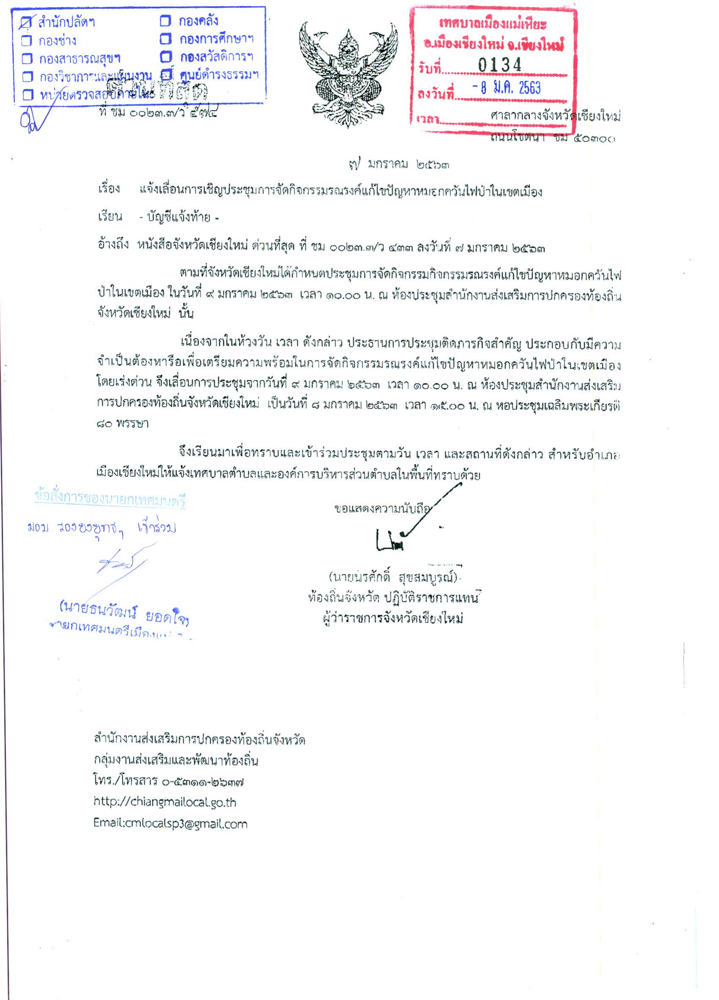
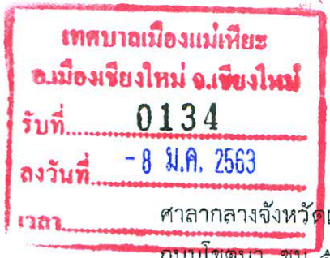

# Recieve mark transcription

## Background
This is a part of bigger project attempted to transcript transfered document fo Thai government agencies.

Using digital data is very convinient but Thai government is still using paperwork many things. 
This then requires human to type all the inportant information in every piece of paper such as where and when it came from? How important is it? What category should it belongs to?
It is a tedious work and mistakes bound to happen after many hours of work. 

The full documents normally look like this.

## This repo

My work specifically was to extract the ID (134) and data (8 ม.ค. 2563: Jan, 8th, 2020) out of this thing.
Other group did the object detection and the image came to me nicely cropped.

Because the ink colors used in every document were the same in this part. 
My method was to first select the black color and transcript that first, the image would look like this.

Then remove everything red using a normal color selection with HSV domain and filter only blue color.

The actual OCR wasn't just using OCR on the image and call it a day. 
Because the ID was always numbers and the data was split into 3 parts, day (1-31), month (12 possible answer), and year (25xx).
I added rule-based check after the OCR, for example if the output was supposed to be numbers but the OCR found a letter "I", it would be safe to assume that it's actually "1".
This increases the accuracy significantly.